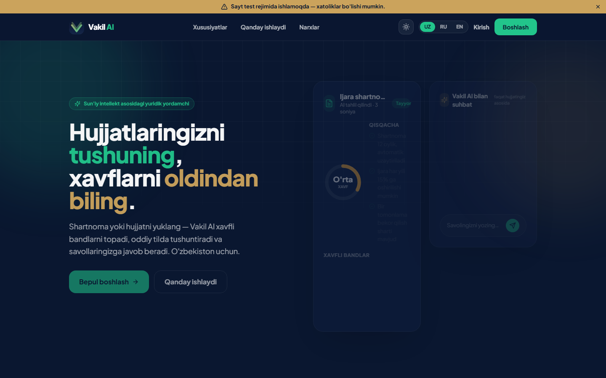
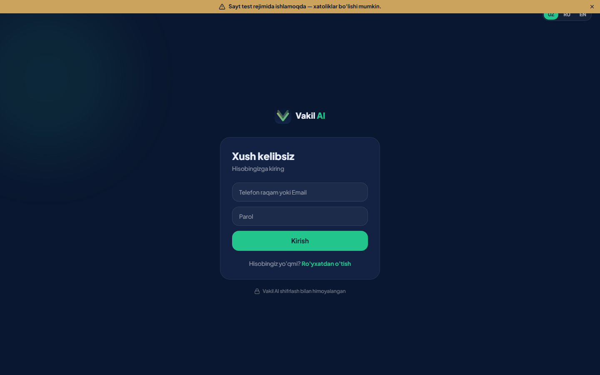
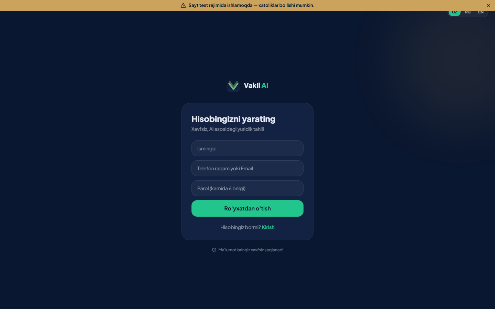

<div align="center">
  
  <h1>Vakil AI</h1>
  <p><b>Sizning professional yuridik yordamchingiz</b><br/>
  AI-powered legal-document assistant for Uzbekistan — uz / ru / en</p>
</div>

---

Vakil AI ("vakil" = advokat) — huquqiy hujjatlar uchun **sun'iy intellekt yordamchisi**. Foydalanuvchi
hujjatni (PDF / matn / rasm) yuklaydi, AI esa:

- ⚠️ **xavfli bandlarni** aniqlaydi (yuqori / o'rta / past)
- 📝 oddiy tilda **qisqacha xulosa** yozadi
- 📅 **muhim sanalar va muddatlarni** ajratadi
- 💬 hujjat bo'yicha **suhbatlashadi** — javob faqat shu hujjat asosida (to'qib chiqarmaydi)

Bepul tarif: oyiga 2 hujjat · Premium: 49 000 so'm/oy (**Payme / Click**).

## 🖼 Screenshots (web)

| Landing | Kirish | Ro'yxatdan o'tish |
|---|---|---|
|  |  |  |

## 📦 Loyiha tuzilishi
```
Vakil AI/
├─ backend/    FastAPI API (async SQLAlchemy + SQLite, Gemini, Payme/Click, Telegram)
├─ vakil_ai/   Flutter mobil ilova (uz/ru/en)
└─ website/    Next.js 14 web ilova — landing + to'liq funksional web app
```
Ikkala mijoz (mobil + web) **bitta backend**ni ishlatadi.

## ✨ Xususiyatlar
- **Hujjat tahlili** — xavf darajasi, xulosa, xavfli bandlar, muhim sanalar
- **AI suhbat** — hujjatga asoslangan, aniq javoblar (`gemini-2.5-flash`, kalitsiz fallback bilan)
- **Auth** — telefon/email + parol (bcrypt + JWT)
- **Obuna** — Payme va Click orqali haqiqiy to'lov
- **3 til** (uz/ru/en) + **dark/light** tema (web)
- **Telegram** integratsiyasi

## 🛠 Ishga tushirish

**Backend:**
```bash
cd backend
python -m venv venv && venv/Scripts/pip install -r requirements.txt
# backend/.env ga GEMINI_API_KEY (va Payme/Click/Telegram kalitlarini) qo'ying
venv/Scripts/python -m uvicorn app.main:app --port 8000
```

**Web (website):**
```bash
cd website
npm install
# .env.local: NEXT_PUBLIC_API_URL=http://localhost:8000
npm run dev
```

**Mobil (Flutter):**
```bash
cd vakil_ai
flutter pub get && flutter run
```

## 🔒 Xavfsizlik
Sirlar (`.env`, `*.db`, `venv`, `node_modules`) `.gitignore` orqali repozitoriyaga kirmaydi.
Ishlab chiqarishdan oldin backend CORS'ini haqiqiy web domenига torайting.

## ⚖️ Eslatma
Vakil AI umumiy ma'lumot beradi va professional yuridik maslahat o'rnini bosmaydi.
