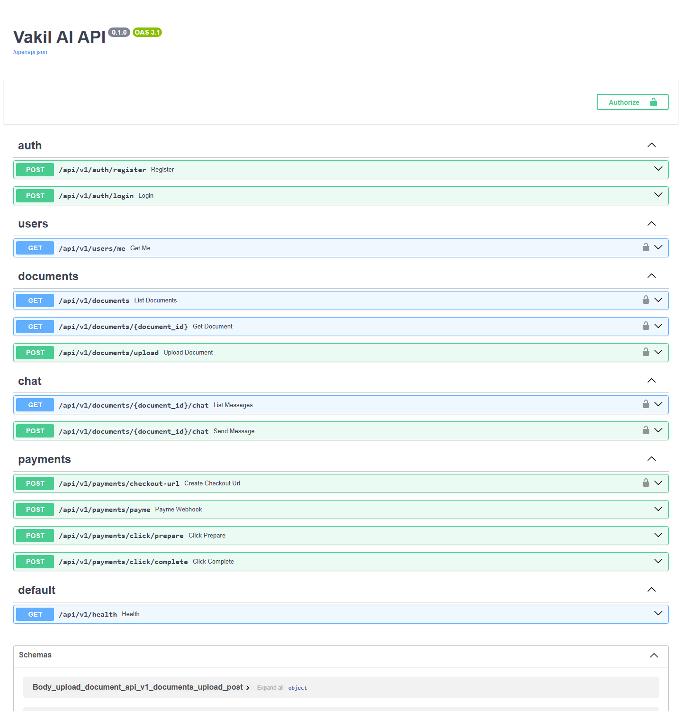

<div align="center">
  
  <h1>Vakil AI</h1>
  <p><b>Your professional legal assistant</b><br/>
  An AI-powered legal-document assistant for Uzbekistan — uz / ru / en</p>
</div>

---

Vakil AI ("vakil" = lawyer) is an **AI assistant for legal documents**. A user uploads a document
(PDF / text / image) and the AI:

- ⚠️ detects **risky clauses** (high / medium / low)
- 📝 writes a plain-language **summary**
- 📅 extracts **key dates and deadlines**
- 💬 lets you **chat about the document** — answers are grounded strictly in that document (no hallucination)

Free tier: 2 documents/month · Premium: 49,000 UZS/month (**Payme / Click**).

## 🖼 Screenshots

**Web app**

| Landing | Log in | Sign up |
|---|---|---|
|  |  |  |

**Backend API (FastAPI · Swagger)**



## 📦 Project structure
```
Vakil AI/
├─ backend/    FastAPI API (async SQLAlchemy + SQLite, Gemini, Payme/Click, Telegram)
├─ vakil_ai/   Flutter mobile app (uz/ru/en)
└─ website/    Next.js 14 web app — landing + full functional web app
```
Both clients (mobile + web) use the **same backend**.

## ✨ Features
- **Document analysis** — risk level, summary, risky clauses, key dates
- **AI chat** — document-grounded, accurate answers (`gemini-2.5-flash`, with an offline fallback)
- **Auth** — phone/email + password (bcrypt + JWT)
- **Subscriptions** — real payments via Payme and Click
- **3 languages** (uz/ru/en) + **dark/light** theme (web)
- **Telegram** integration

## 🛠 Getting started

**Backend:**
```bash
cd backend
python -m venv venv && venv/Scripts/pip install -r requirements.txt
# put GEMINI_API_KEY (and Payme/Click/Telegram keys) in backend/.env
venv/Scripts/python -m uvicorn app.main:app --port 8000
# API docs: http://localhost:8000/docs
```

**Web (website):**
```bash
cd website
npm install
# .env.local: NEXT_PUBLIC_API_URL=http://localhost:8000
npm run dev
```

**Mobile (Flutter):**
```bash
cd vakil_ai
flutter pub get && flutter run
```

## 🔒 Security
Secrets (`.env`, `*.db`, `venv`, `node_modules`) are kept out of the repo via `.gitignore`.
Before production, tighten the backend CORS to the real web origin.

## ⚖️ Disclaimer
Vakil AI provides general information and is not a substitute for professional legal advice.
